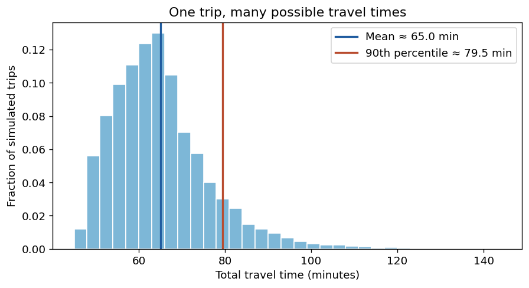
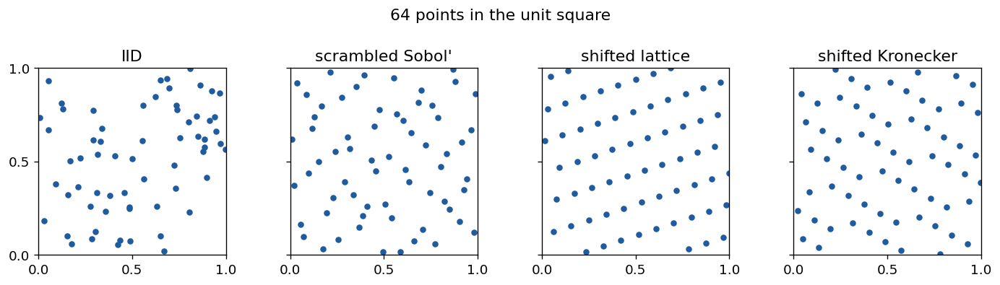
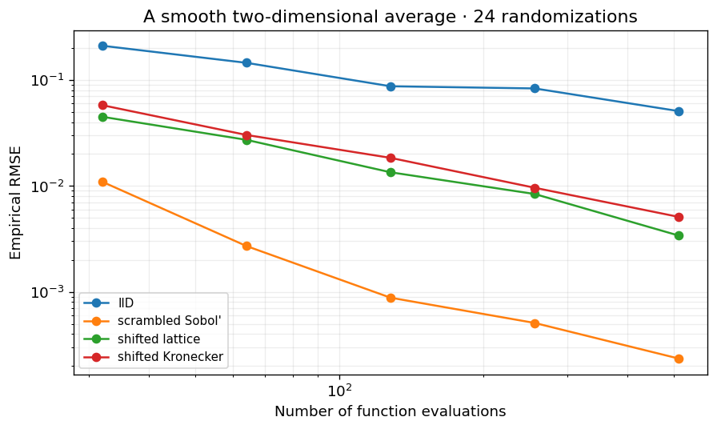
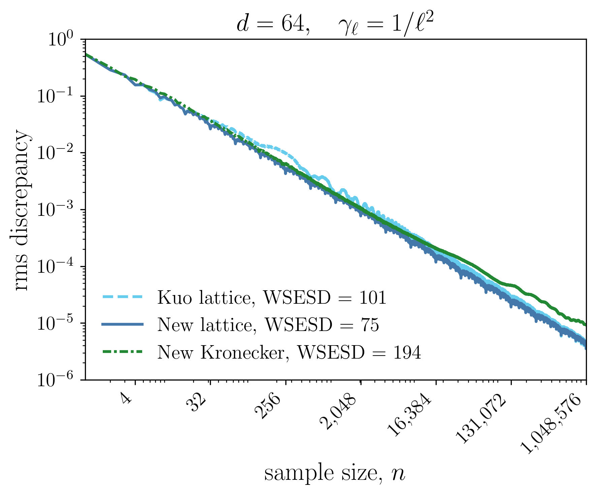
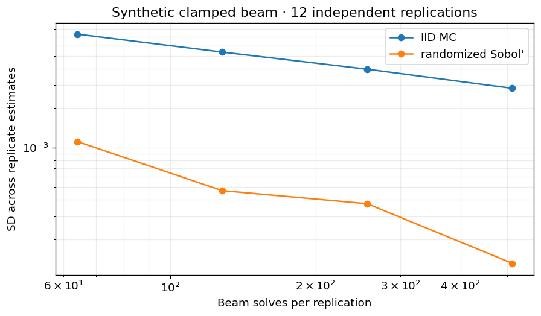

## The route

1. [Monte Carlo]{.alert}: turn uncertainty into an average
2. [Low discrepancy]{.alert}: place evaluations more evenly
3. [Recent work]{.alert}: keep the freedom to add samples
4. [Practice]{.alert}: QMCPy and an AI-guided beam experiment

[Companion notebook](https://github.com/fjhickernell/StrategicSamplingColloquium/blob/main/notebooks/StrategicSampling.ipynb){.small}

# From Uncertainty to an Average

## How long should a trip take?

A 5-minute walk, a 30-minute train ride, and a 12-minute taxi ride are fixed

- Wait up to 20 minutes for the train
- The taxi is ready with probability 0.2; otherwise there is another wait

::: {.key-point}
One sample means one plausible trip through these uncertain waits
:::

[Adapted from MATH 565, “Are We There Yet?”](https://github.com/fjhickernell/MATH565Fall2026/blob/main/notebooks/applications/AreWeThereYet.ipynb){.small}

## One trip, many possible travel times

::: {style="text-align:center;"}
{fig-alt="Histogram of simulated trip times, with vertical lines at the mean and 90th percentile" width=65%}
:::

20,000 simulated trips · the mean and a high percentile answer different questions

## The same mathematical pattern

Let $U$ represent uncertain inputs and $f(U)$ the outcome of a simulation

\begin{equation*}
\mu = \mathbb E[f(U)]
\qquad\longrightarrow\qquad
\widehat\mu_n=\frac{1}{n}\sum_{i=0}^{n-1}f(u_i)
\end{equation*}

This is [Monte Carlo]{.alert}: run the simulator repeatedly and average the outcomes

The exact average may be hard to calculate, even when each $f(u_i)$ is available

[Source: MATH 565, Introduction](https://github.com/fjhickernell/MATH565Fall2026/blob/main/slides/01-introduction.qmd){.small}

## A checkable miniature example

Two uniform inputs; one smooth outcome

\begin{equation*}
f(u_1,u_2)=e^{u_1+u_2},\qquad
\mu=\int_{[0,1]^2}f(u)\,du=(e-1)^2\approx 2.9525
\end{equation*}

With a known answer, we can see how the sample placement changes the error

The [notebook](https://github.com/fjhickernell/StrategicSamplingColloquium/blob/main/notebooks/StrategicSampling.ipynb) reproduces this example

## Why put inputs in a unit cube?

A uniform input $U\in[0,1]^d$ can be transformed into model inputs

\begin{equation*}
U\quad\xrightarrow{\text{probability transform}}\quad X
\quad\xrightarrow{\text{simulation}}\quad Y=f(X)
\end{equation*}

The same sampling designs can then serve many applications

[Source: MATH 565, Generating Samples](https://github.com/fjhickernell/MATH565Fall2026/blob/main/slides/02-generating-samples.qmd){.small}

# What IID Gives Us

## Independent, identically distributed samples

Each $u_i$ is drawn afresh from the same uniform distribution

- [Flexible]{.alert}: stop after any number $n$, then continue
- [Simple]{.alert}: independent samples make uncertainty analysis familiar
- [Irregular]{.alert}: chance leaves gaps and clusters

## Same budget, different coverage

{fig-alt="Four plots of 64 two-dimensional samples: IID, scrambled Sobol, shifted lattice, and shifted Kronecker" width=95%}

One randomized realization of each design · generated by the companion notebook

## What randomness costs

For IID outcomes with variance $\sigma^2$,

\begin{equation*}
\operatorname{SD}(\widehat\mu_n)=\frac{\sigma}{\sqrt n}
\end{equation*}

To cut typical sampling error in half, roughly [four times]{.alert} as many model evaluations are needed

This is a baseline, not a promise about every simulation

# More Evenly Placed Samples

## The low discrepancy (LD) idea

Choose points so the empirical sample covers the unit cube well

- [IID]{.alert}: every point is placed independently
- [LD]{.alert}: points are arranged jointly to reduce gaps and imbalances

::: {.key-point}
The goal is a more accurate average for the same number of model evaluations
:::

[Source: MATH 565, Improving Efficiency](https://github.com/fjhickernell/MATH565Fall2026/blob/main/slides/04-improving-efficiency.qmd){.small}

## The running example: empirical error

::: {style="text-align:center;"}
{fig-alt="Empirical root mean squared integration error across sample sizes for IID, scrambled Sobol, shifted lattice, and shifted Kronecker sampling" width=70%}
:::

24 independent randomizations per point · one smooth two-dimensional function

## Why randomize a structured design?

A random shift or scramble retains the design's coverage pattern

- Every point is uniform on the unit cube
- Independent *replications* give a way to assess sampling variability
- A Gaussian probability transform avoids an exact zero coordinate

::: {.key-point}
Randomized low discrepancy joins organized placement with uncertainty assessment
:::

## A one-dimensional clue: digit reversal

Read the binary digits of an integer backward after the binary point

\begin{equation*}
0,1,2,3,4,5,6,7
\quad\longmapsto\quad
0,\tfrac12,\tfrac14,\tfrac34,\tfrac18,\tfrac58,\tfrac38,\tfrac78
\end{equation*}

Each new block fills gaps left by earlier points

The older points stay in place as the sequence grows

## The catch: favored sample sizes

| Design | Natural prefixes |
|:---|:---|
| IID | Every $n$ |
| Scrambled Sobol' and standard lattice rules | Strongest balance at $n=2^m$ |
| Kronecker sequences | Every $n$ |

At $n=97$, should we discard work, wait until $128$, or use the $97$ points well?

# Recent Work: Flexible Low Discrepancy

## Keep the points already evaluated

An [extensible sequence]{.alert} keeps every prefix

\begin{equation*}
\{u_0,\ldots,u_{63}\}
\subset
\{u_0,\ldots,u_{96}\}
\subset
\{u_0,\ldots,u_{127}\}
\end{equation*}

The research question is the [quality of every prefix]{.alert}, not just the full preferred blocks

## Lattice and Kronecker: two ways to proceed

::: {.columns}
::: {.column width="47%"}
### Lattice sequence

\begin{equation*}
u_i=\phi_2(i)\,\zeta+\Delta\pmod 1
\end{equation*}

Reverse the binary digits of $i$ before stepping around the cube

Strong structure at powers of two
:::
::: {.column width="47%"}
### Kronecker sequence

\begin{equation*}
u_i=i\,\zeta+\Delta\pmod 1
\end{equation*}

Take another step by the same vector $\zeta$

A natural prefix at every $n$
:::
:::

[Source: MCQMC 2026 special-session talk](https://fjhickernell.github.io/MCQMC26/slides/SpecialSession_MCQMC2026.html){.small}

## Losing a few points

Real computation can produce missing or unusable evaluations

- Deleting points can disrupt the design's preferred structure
- A bounded number of missing or added points need not erase useful asymptotic coverage
- Losing a fixed [fraction]{.alert} is a different, harder problem

The distinction is central to the theory and to software behavior

[Source: MCQMC 2026 special-session talk, “The best we can hope for”](https://fjhickernell.github.io/MCQMC26/slides/SpecialSession_MCQMC2026.html#the-best-we-can-hope-for){.small}

## How do we choose a good sequence?

[Discrepancy]{.alert} measures how well sample averages represent a chosen class of functions

A practical construction can

1. Set a criterion across many sample sizes
2. Choose the first generator coordinate
3. Add and optimize one coordinate at a time

This is a [component-by-component]{.alert} search

## Recent computation: quality across $n$

::: {style="text-align:center;"}
{fig-alt="Root mean squared discrepancy versus sample size for an established lattice, a newly constructed lattice, and a newly constructed Kronecker sequence in 64 dimensions" width=50%}
:::

$d=64$, coordinate weights $\gamma_\ell=\ell^{-2}$ · lower is better for this discrepancy criterion

[Source and construction details: MCQMC 2026 plenary talk](https://fjhickernell.github.io/MCQMC26/slides/Plenary_MCQMC2026.html#sequences-that-are-good-for-all-n){.small}

## What this figure does and does not say

- The constructed lattice has a smaller [weighted aggregate discrepancy]{.alert} in this benchmark (75 versus 101)
- Kronecker gives a natural sequence at arbitrary sizes, with different strengths
- Performance on an application also depends on the function, the transform, and the coordinate order

::: {.key-point}
There is no single best design for every problem
:::

# From Mathematics to Practice

## QMCPy connects the pieces

\begin{equation*}
\text{sample generator}
\longrightarrow\text{probability model}
\longrightarrow\text{simulation / integrand}
\longrightarrow\text{error assessment}
\end{equation*}

[QMCPy](https://qmcpy.org/) supplies LD designs and tools for integration and stopping

The companion notebook compares IID, Sobol', lattice, and Kronecker generators on equal budgets

## A short QMCPy example

```python
import numpy as np
import qmcpy as qp

n = 128
u = qp.Kronecker(dimension=2, seed=9).gen_samples(n)
answer = np.exp(u[:, 0] + u[:, 1]).mean()
```

The same generator can produce $97$ or $128$ points; the first $97$ remain the same when the sequence is extended with the same seed

[Run the companion notebook](https://github.com/fjhickernell/StrategicSamplingColloquium/blob/main/notebooks/StrategicSampling.ipynb){.small}

# AI-Accelerated Research

## Where AI helps our work now

- Turn mathematical specifications into computational prototypes
- Review, debug, and refactor research software
- Help explain results and improve documentation

::: {.key-point}
Researchers still set the questions and check the mathematics and numerical evidence
:::

[Source: MCQMC 2026 plenary talk, “AI used well”](https://fjhickernell.github.io/MCQMC26/slides/Plenary_MCQMC2026.html#ai-used-well){.small}

## A more realistic computation: a beam

A clamped beam has uncertain stiffness along its length

\begin{equation*}
(B(x,Z)w''(x,Z))''=1,
\qquad Y(Z)=384w(1/2,Z),
\qquad \mu=\mathbb E[Y]
\end{equation*}

Each sample of the eight Gaussian inputs $Z$ requires a numerical beam solve

The normalized midpoint deflection is $Y=1$ for uniform unit stiffness

[Synthetic model and reproducible solver in the companion notebook](https://github.com/fjhickernell/StrategicSamplingColloquium/blob/main/notebooks/StrategicSampling.ipynb){.small}

## Same beam budget; different sampling variability

::: {style="text-align:center;"}
{fig-alt="Standard deviation across independent replicate beam estimates for IID Monte Carlo and randomized Sobol sampling at equal beam solves" width=70%}
:::

12 independent replications · eight uncertain inputs · same beam solves per replication

Spatial-resolution error requires a separate check

## Let software coordinate a bounded experiment

The [Pydantic AI]{.alert} prototype exposes tools to

1. Inspect the experiment and budget
2. Check paired spatial refinements
3. Compare IID and randomized LD pilots
4. Choose one fresh validation run

The tools enforce the protocol and record the numerical evidence

## What the AI demonstration establishes

The reproducible demonstration runs a [scripted policy]{.alert} through the Pydantic AI tool loop

- Real numerical tools and a recorded decision path
- No language model needed to reproduce the baseline
- An optional live-model adapter uses the same bounded tools

A finite spatial check and replicate-based interval are diagnostics, [not certified total-error bounds]{.alert}

## Take-home message

::: {.main-message}
Sample more strategically while keeping the freedom to add more as needed
:::

- Mathematics constructs and assesses LD sequences across sample sizes
- QMCPy makes the designs usable in simulations
- AI can accelerate experiments and software when its choices are checked

## Sources and further exploration

- [Companion notebook and beam code](https://github.com/fjhickernell/StrategicSamplingColloquium)
- [MATH 565 course slides](https://github.com/fjhickernell/MATH565Fall2026/tree/main/slides)
- [MCQMC 2026 plenary and special-session talks](https://fjhickernell.github.io/MCQMC26/)
- [QMCPy documentation](https://qmcpy.org/)
