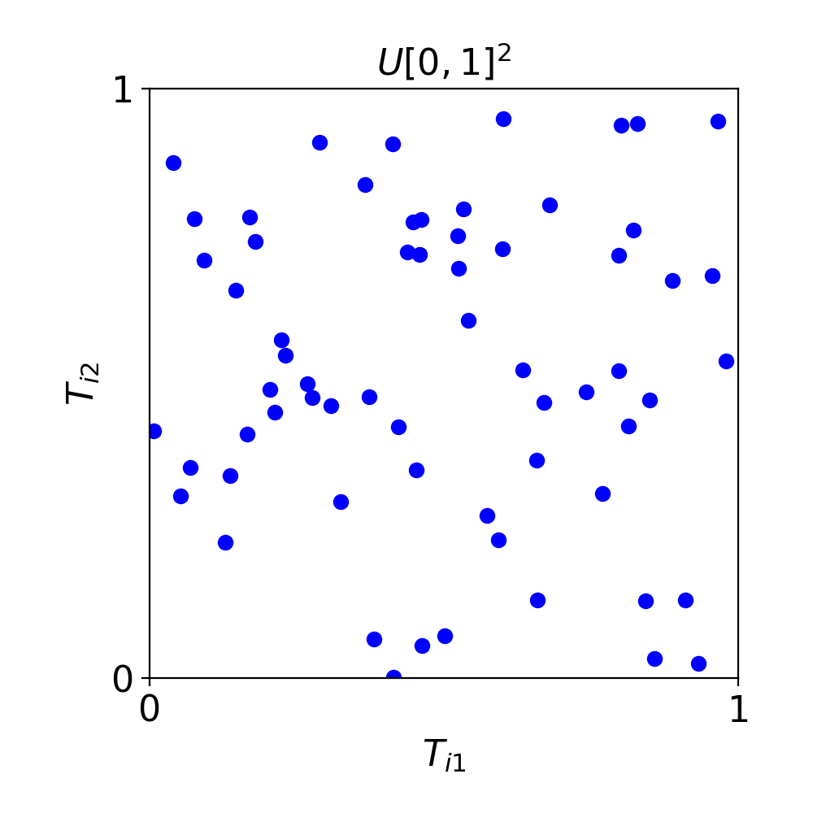
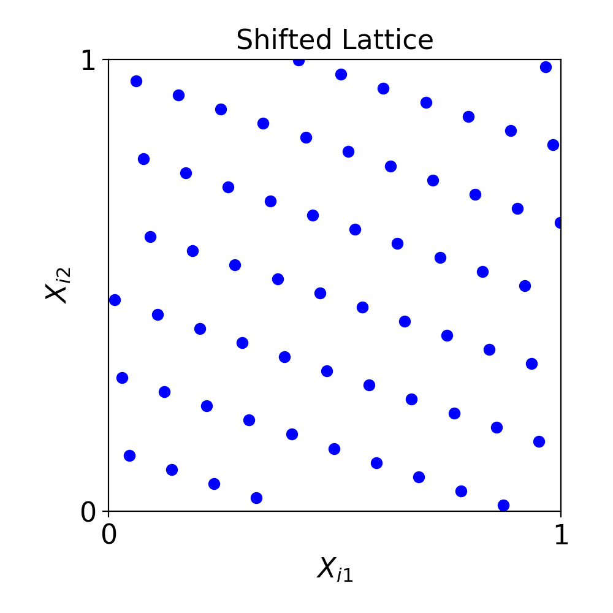

## Why sampling matters

Many calculations ask for an [average]{.alert} over possible scenarios

\begin{equation*}
\text{average outcome} \approx
\frac{1}{n}\sum_{i=1}^{n}\text{outcome from sample }i
\end{equation*}

Each sample may require an expensive simulation

::: {.key-point}
Can we learn more from the same number of simulations?
:::

## The same number of samples, different coverage

::: {.columns}
::: {.column width="47%"}
### IID

{fig-alt="Independent random samples show visible gaps and clusters" width=90%}

Chance creates gaps and clusters
:::

::: {.column width="47%"}
### Low discrepancy

{fig-alt="Shifted lattice samples are more evenly spread" width=90%}

Points cover the space more evenly
:::
:::

[Figures: QMCSoftware, “Why Add Q to MC?”](https://qmcsoftware.org/blogs/why-add-q-to-mc/){.small}

## The flexibility question

| Sampling method | Number of samples |
|:---|:---|
| IID | Stop after any $n$ |
| Many standard low discrepancy constructions | Best at selected sizes, often powers of a base |

Real computations may stop early or gain a larger budget

::: {.key-point}
We want [even coverage]{.alert} without committing to a preferred sample size
:::

## Keep the samples already computed

An [extensible sequence]{.alert} lets us add points without starting over

\begin{equation*}
x_1,\ldots,x_{n} \quad\longrightarrow\quad
x_1,\ldots,x_{n},x_{n+1},\ldots,x_{n+m}
\end{equation*}

The question is how well *every prefix* covers the space

## Lattices and Kronecker sequences

- [Lattice rules]{.alert}: highly structured point sets with strong performance at chosen sizes
- [Kronecker sequences]{.alert}: one continuing sequence, generated by repeated steps around the unit cube
- Our research asks how to choose these constructions for useful coverage across sample sizes

## How should we judge a sequence?

Look beyond one favored sample size

- Check coverage as the sample count grows
- Compare with established low discrepancy designs and IID sampling
- Test on integration problems, not only geometric pictures

## From a construction to a computation

::: {.key-point}
Choose samples $\longrightarrow$ transform them into scenarios $\longrightarrow$
compute the average $\longrightarrow$ assess the error
:::

[QMCPy](https://qmcpy.org/) brings these steps into one Python workflow

It supports low discrepancy generators, probability models, integration algorithms, and stopping criteria

## AI in the research workflow

AI can help us explore ideas and develop software faster

- Draft and revise code for experiments
- Help write tests and inspect computational results
- Suggest patterns or questions for mathematical follow-up

Numerical checks, proofs, and scientific judgment determine what we can claim

## Main message

::: {.main-message}
Place samples more strategically while keeping the freedom to add more when needed
:::

New constructions, QMCPy, and AI-assisted development each help close the gap between mathematical ideas and practical simulation

## Background and software

- [Quasi-Monte Carlo methods: what, why, and how?](https://qmcsoftware.org/publications/)
- [MCQMC 2026 special-session talk](https://fjhickernell.github.io/MCQMC26/slides/SpecialSession_MCQMC2026.html)
- [QMCPy](https://qmcpy.org/)
